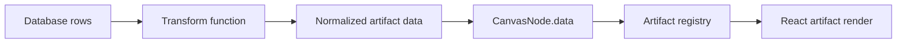

# freeform-artifacts

Browser-first Freeform-style canvas for AI-generated data artifacts.

`freeform-artifacts` is a demo product surface for placing JS/TS-rendered
artifact cards on a zoomable and pannable canvas. The first use case is
database-backed cards: raw rows can be transformed into normalized artifact data,
then rendered by registry-approved React/TypeScript components.

## Quick Start

Install dependencies:

```sh
npm install
```

Install the browser used by Playwright verification:

```sh
npm run setup:browsers
```

Run the app:

```sh
npm run dev
```

Open the local URL:

```text
http://127.0.0.1:4177
```

Run deterministic checks:

```sh
npm run check
npm run verify:ui
```

Create a shareable browser proof GIF:

```sh
npm run verify:proof
```

The proof run writes local evidence under:

```text
artifacts/verification/<timestamp>/
```

Those artifacts are ignored by git and are meant for local handoff evidence.

## Interactive Canvas

Current controls:

- Drag an artifact card to move it.
- Drag empty canvas space to pan.
- Scroll over the canvas to zoom around the pointer.
- Use the bottom-left zoom controls to zoom or reset the view.
- Toggle light/dark mode from the top toolbar.
- Collapse or reopen the sidebar from the top-left controls.
- Click **Add artifact** to insert a registry-backed example card.

The canvas stores nodes in world coordinates. The viewport stores screen offset
and scale. Rendering converts world coordinates into a single transformed DOM
layer, which keeps artifact components as normal React/DOM content instead of
forcing them into a low-level drawing API.

## Artifact Runtime

Artifacts are registered in `src/artifacts/registry.ts`.

An artifact is a typed object with an id, version, default size, optional data
schema hints, optional config schema hints, and a render function:

```ts
export interface ArtifactDefinition<TData = unknown, TConfig = JsonObject> {
  id: string;
  title: string;
  version: string;
  defaultSize: {
    width: number;
    height: number;
  };
  dataSchema?: JsonObject;
  configSchema?: JsonObject;
  render: (props: ArtifactRenderProps<TData, TConfig>) => React.ReactNode;
}
```

Canvas nodes reference artifact definitions by `artifactId`:

```ts
export interface CanvasNode<TConfig = JsonObject> {
  id: string;
  artifactId: string;
  title: string;
  x: number;
  y: number;
  width: number;
  height: number;
  zIndex: number;
  dataBinding?: DataBinding;
  data: unknown;
  config: TConfig;
}
```

## AI Artifact Contract

AI-generated artifacts should follow these rules:

- Export exactly one `ArtifactDefinition`.
- Do not mutate canvas state directly.
- Receive all display input through `data`, `config`, `theme`, and `emit`.
- Keep database-specific logic outside the render component.
- Put data shaping in a named transform before artifact rendering.
- Use deterministic layout; do not depend on global timers, random values, or
  network fetches during render.
- Declare default width and height so the canvas can place the artifact before
  rendering it.
- Treat `emit` as the only outward event channel.

The intended pipeline is:



## Rendering Boundary

This demo intentionally uses DOM-based artifacts rather than drawing all content
into `<canvas>`. That keeps tables, charts, forms, text selection, layout, and
future accessibility work close to the browser platform.

The product boundary is:

```text
  user input / AI request
          |
          v
  artifact definition + data transform
          |
          v
  registry-approved artifact
          |
          v
  canvas node in world coordinates
          |
          v
  DOM render inside pan/zoom viewport
```

## Project Status

Implemented:

- React/TypeScript/Vite demo app.
- Pannable and zoomable dotted canvas.
- Draggable artifact nodes.
- Selection inspector.
- Registry-backed metric, table, and trend artifacts.
- Playwright UI smoke test.
- Browser proof GIF recorder.
- Light/dark theme support.
- Collapsible sidebar.
- Hardened pointer dragging that suppresses browser text selection and native
  drag behavior during canvas moves.
- Handoff docs for the next Codex session.

TODO:

- Add resize handles for cards.
- Add multi-select and z-order controls.
- Add JSON-schema or Zod-backed validation for AI-generated artifact modules.
- Add sandbox strategy before loading untrusted generated code.
- Add persistent board serialization.
- Add import path for real database query results.
- Add transform registry with test fixtures.
- Add visual diff thresholds for proof recordings.
- Add a production build preview verification path.

## Documentation

Read these first when getting oriented:

1. `README.md`
2. `AGENTS.md`
3. `CHANGELOG.md`
4. `docs/INDEX.md`

Maintainer details live under `docs/`.

Design and engineering tradeoffs are recorded in
`docs/architecture-decisions.md`.
