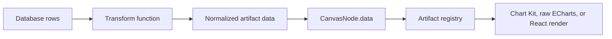

# freeform-artifacts

Browser-first Freeform-style canvas for AI-generated data artifacts.

`freeform-artifacts` is a demo product surface for placing JS/TS-rendered
artifact cards on a zoomable and pannable canvas. The first use case is
database-backed cards: raw rows can be transformed into normalized artifact data,
then rendered by declarative Chart Kit specs, managed raw ECharts options, or
registry-approved React/TypeScript components.

## Product Boundary

This project is canvas-first, not dashboard-first. The first screen should stay
focused on placing, moving, resizing, panning, zooming, and viewing artifacts
in a Freeform-style workspace.

It is not a landing page, admin dashboard, or server management console. It is
also not a general drawing engine yet. Generated artifacts enter through the
artifact registry contract; they do not own the whole page or mutate canvas
internals directly.

## Quick Start

Install dependencies:

```sh
npm install
```

Install the browser used by Playwright verification:

```sh
npm run setup:browsers
```

Run the app:

```sh
npm run dev
```

Open the local URL:

```text
http://127.0.0.1:4177
```

Run deterministic checks:

```sh
npm run check
npm run verify:ui
npm run verify:preview
```

Create a shareable browser proof GIF:

```sh
npm run verify:proof
```

The proof run writes local evidence under:

```text
artifacts/verification/<timestamp>/
```

Those artifacts are ignored by git and are meant for local handoff evidence.
The recorder drives a complete asserted UX journey, exposes its current action
with a verification-only cursor and label, and writes `ux-checks.json` plus a
30-cell contact sheet for internal review. The GIF remains the only proof users
need to inspect.

## Project Skill

This repo includes a project-local Codex skill for future agents:

```text
skill/freeform-artifact-builder/
```

Use it when adding or revising canvas artifacts:

```sh
npx skills use ./skill --skill freeform-artifact-builder --full-depth
```

To confirm the package exposes the skill to the current `skills` CLI:

```sh
npx skills add . --list --full-depth
```

## Interactive Canvas

Current controls:

- Drag an artifact card to move it.
- Hold `Shift` while dragging blank canvas space to marquee-select artifacts;
  use `Shift`/`Cmd`/`Ctrl` click to adjust the selection, then drag any selected
  card to move the whole selection.
- Use the contextual selection toolbar to align, distribute, duplicate, or
  delete multiple artifacts.
- Drag the selected card's labeled bottom-right resize control to resize it.
- Delete the selected artifact from its title bar, or press `Delete` or
  `Backspace` while canvas focus is outside an input.
- Keep snap-to-grid on by default for 38px world-coordinate placement; toggle
  it from **More > Snap to grid**, where a compact switch shows the current
  state while changing the setting.
- Drag empty canvas space to pan.
- Scroll with a trackpad or mouse wheel to pan naturally in either direction.
- Pinch on a trackpad to zoom around the pointer.
- Use the bottom-left zoom controls to zoom or reset the view.
- Toggle light/dark mode from the top toolbar.
- Double-click the centered canvas name to rename the current view.
- Open the collapsed **Views** sidebar to browse real canvas previews, create
  views, duplicate or delete them, drag them into a stable order, and switch
  between independent browser-local workspaces. A deleted view can be restored
  from the short-lived Undo notice. On touch layouts, use the visible close
  button or tap outside the drawer; **Move up** and **Move down** provide a
  non-drag ordering path.
- Open **Artifacts** from the top bar to search built-in and personal items,
  inspect a complete live preview, then click to add one at the nearest open
  position in the current viewport, or drag it to a specific canvas position.
  Removing a card does not remove its reusable artifact package.
- Use `Cmd/Ctrl+Z` and `Shift+Cmd/Ctrl+Z` for session Undo/Redo; `Cmd/Ctrl+A`
  selects all artifacts, `Cmd/Ctrl+D` duplicates, and `Cmd/Ctrl+C` / `V`
  copy and paste within the active browser view. Use `Cmd/Ctrl+B` for Views,
  `Shift+Cmd/Ctrl+A` for Artifacts, `Cmd/Ctrl+0` to reset the viewport,
  `+`/`-` to zoom, and `Escape` to close the active panel or clear selection.
  Canvas shortcuts do not intercept editable fields or the Build with AI dialog.
- Use the **More** menu to load sample query rows, import/export a versioned
  workspace backup, enter a clean Fit All presentation, or explicitly reset to
  the authored demo. In presentation mode, use Left/Right to move between views
  and `Escape` to return without changing the saved viewport, or use the compact
  on-canvas navigation and exit controls.
- Open **Build with AI** from the desktop top bar or the Artifact Library footer
  and give its instruction to your coding agent. The
  prompt explicitly selects Browser View Bundle delivery, installs the project
  skill, asks the agent to learn what artifact you want, validates the bundle
  without persistence, and then installs it into the named local view. Otherwise
  install the returned `.freeform-artifact.json` from the dialog.

The canvas stores nodes in world coordinates. The viewport stores screen offset
and scale. Rendering converts world coordinates into a single transformed DOM
layer, which keeps artifact components as normal React/DOM content instead of
forcing them into a low-level drawing API.

Board state is automatically saved in the browser-local workspace and restored
on reload, including the current theme and snap-to-grid preference.

## Artifact Runtime

Artifacts are registered in `src/artifacts/registry.ts`.

The registry is layered:

- `src/artifacts/core/` contains platform-provided building blocks such as
  metric and table cards.
- `src/artifacts/examples/` contains demo and verification artifacts such as the
  probability chart, Sankey, and flow diagram.
- `src/artifacts/generated/` is the entry point for self-deployed user or
  AI-generated artifacts.
- `src/canvas/seeds/demoBoard.ts` chooses which artifacts appear on the default
  demo board.

## Adding A Customized Artifact

There are separate trusted-code delivery modes. Runtime bundles are the default
for personal browser views; repo-compiled TSX is for users who own and deploy the
application. The skill requires this choice before files are created.

The product's **Build with AI** dialog creates an agent-neutral handoff. It
installs the public project skill with an interactive agent choice:

```sh
npx skills add siriusctrl/freeform-artifacts --skill freeform-artifact-builder
```

The generated instruction includes `Delivery mode: BROWSER_VIEW_BUNDLE` and the
target view id. After skill installation, it tells the agent to ask what the
user wants to build and clarify its data, visual form, and layout. It then asks
for one self-contained trusted bundle with `artifactId`, ESM `moduleSource`,
and initial node data, while explicitly forbidding application repo changes.
Bundle code is stored once per browser origin in IndexedDB; the installed node
belongs only to the target local view. Artifact ids are immutable package
identities: installing different code under an existing id is rejected instead
of silently changing cards in other views. Installed packages also appear under
**Artifacts > Yours**, shared by every local view in that browser profile, so a
deleted node can be placed again without reinstalling its bundle.

### Runtime Artifact Bundle

Use this for normal AI-created artifacts. An agent with browser control calls:

```js
await page.evaluate(
  (bundle) => window.__FREEFORM_AGENT__.validateArtifact(bundle),
  bundle,
);

await page.evaluate(
  ({ bundle, viewId }) => window.__FREEFORM_AGENT__.installArtifact(bundle, { viewId }),
  { bundle, viewId },
);
```

Without browser control, choose **Install bundle** in the Build with AI dialog.
Bundle modules are trusted code and are not sandboxed.

### Repo-Compiled TSX

Use Self-Deployed Repo mode when an agent can write into the app repo and the
user intends to rebuild and deploy it.

1. Create `src/artifacts/generated/my-artifact.artifact.tsx`.
2. Export `artifact`, `default`, or `artifacts`.
3. The generated registry auto-discovers `*.artifact.tsx` files with Vite
   `import.meta.glob`.
4. If the artifact should appear on the default board, add a `CanvasNode` in
   `src/canvas/seeds/demoBoard.ts`.
5. Run the verification commands.

### Runtime External ESM

Use this when the deployed app owner wants to drop trusted JavaScript modules
under `public/` without rebuilding the main app.

1. Add a compiled ESM file such as:

```text
public/artifacts/generated/my-artifact.js
```

2. Add it to:

```text
public/artifacts/generated/manifest.json
```

```json
{
  "artifacts": [
    { "module": "./my-artifact.js" }
  ]
}
```

3. Export `artifact`, `default`, or `artifacts` from the module.

External runtime modules are trusted self-hosted code. They execute in the page,
are not sandboxed, and should be treated as "take your own risk" plugins.
The loader fetches these files and imports them as Blob-backed browser modules,
so keep runtime modules self-contained instead of using relative imports.
Runtime React artifacts can use `window.React.createElement`; runtime `.js`
files cannot contain raw JSX unless they are compiled first.

An artifact is a typed object with an id, version, default size, optional
minimum size, schema hints, and a renderer-specific body.

Chart Kit is the default for bar, line, and combo charts. It produces managed
ECharts options with consistent light/dark tokens, dataset encoding, axes,
tooltip, palette, ARIA, SVG rendering, and lifecycle:

```ts
export interface ChartKitArtifactDefinition<TData = unknown, TConfig = JsonObject> {
  id: string;
  title: string;
  version: string;
  renderer: "chart-kit";
  defaultSize: ArtifactSize;
  minSize?: ArtifactSize;
  buildChart: (props: ArtifactRenderProps<TData, TConfig>) => ChartKitSpec;
}
```

React artifacts own their component render function:

```ts
export interface ReactArtifactDefinition<TData = unknown, TConfig = JsonObject> {
  id: string;
  title: string;
  version: string;
  defaultSize: {
    width: number;
    height: number;
  };
  minSize?: { width: number; height: number };
  dataSchema?: JsonObject;
  configSchema?: JsonObject;
  dataValidator?: ZodType<TData>;
  configValidator?: ZodType<TConfig>;
  render: (props: ArtifactRenderProps<TData, TConfig>) => React.ReactNode;
}
```

Raw ECharts artifacts are the advanced escape hatch and only build chart
options. The host owns `echarts.init`,
`setOption`, `resize`, and `dispose`. Every render receives `size`, the live
internal content-box dimensions. On this canvas, a card renders in its
registered `defaultSize` coordinate system and the resize handle scales the
complete artifact at a locked aspect ratio. Complex artifacts should declare
`minSize` to set the smallest permitted object scale:

```ts
export interface EChartsArtifactDefinition<TData = unknown, TConfig = JsonObject> {
  id: string;
  title: string;
  version: string;
  renderer: "echarts";
  chartRenderer?: "svg" | "canvas";
  interactive?: boolean;
  defaultSize: {
    width: number;
    height: number;
  };
  minSize?: { width: number; height: number };
  dataSchema?: JsonObject;
  configSchema?: JsonObject;
  dataValidator?: ZodType<TData>;
  configValidator?: ZodType<TConfig>;
  buildOption: (props: ArtifactRenderProps<TData, TConfig>) => EChartsOption;
}
```

Canvas nodes reference artifact definitions by `artifactId`:

```ts
export interface CanvasNode<TConfig = JsonObject> {
  id: string;
  artifactId: string;
  title: string;
  x: number;
  y: number;
  width: number;
  height: number;
  zIndex: number;
  dataBinding?: DataBinding;
  data: unknown;
  config: TConfig;
}
```

## AI Artifact Contract

AI-generated artifacts should follow these rules:

- Export exactly one `ArtifactDefinition`.
- Prefer `renderer: "chart-kit"` for ordinary bar, line, and combo charts.
- Use raw `renderer: "echarts"` only for registered capabilities Chart Kit
  cannot express. The current raw host registers bar, line, and Sankey.
- For raw ECharts artifacts, generate data transforms and `buildOption`; do not
  call `echarts.init` or manage chart lifecycle inside the artifact.
- Leave raw ECharts artifacts non-interactive by default so the whole card remains
  draggable. Set `interactive: true` only when the chart needs hover, tooltip,
  click, or brush behavior.
- Use React artifacts when the visual is not well represented by ECharts or
  needs custom UI composition.
- Do not mutate canvas state directly.
- Receive all display input through `data`, `config`, `theme`, and `size`.
- Keep database-specific logic outside the render component.
- Put data shaping in a named transform before artifact rendering.
- Add a Zod `dataValidator` to repo-compiled artifacts. Self-contained runtime
  bundles cannot import Zod, so keep their payload guards inside renderer code;
  the host isolates renderer failures to the affected card.
- Use deterministic layout; do not depend on global timers, random values, or
  network fetches during render.
- Declare default width and height so the canvas can place the artifact before
  rendering it.

The intended pipeline is:



## Rendering Boundary

This demo intentionally uses DOM-based artifacts rather than drawing all content
into `<canvas>`. That keeps tables, charts, forms, text selection, layout, and
future accessibility work close to the browser platform.

The product boundary is:

```text
  user input / AI request
          |
          v
  artifact definition + data transform
          |
          v
  registry-approved artifact
          |
          v
  canvas node in world coordinates
          |
          v
  DOM render inside pan/zoom viewport
```

## Project Status

Implemented:

- React/TypeScript/Vite demo app.
- Pannable and zoomable dotted canvas.
- Draggable artifact nodes.
- Resizable selected artifact nodes.
- Selected-artifact deletion through a title-bar control and keyboard shortcuts.
- Bounded session Undo/Redo with one history entry per completed drag or resize.
- Additive and marquee multi-selection, group movement, alignment/distribution,
  duplicate, and in-session copy/paste commands.
- Default-on 38px snap-to-grid placement with a labeled More-menu toggle.
- Aspect-locked whole-object resizing with artifact-specific minimum scales.
- Published demo template with a per-browser local workspace fork.
- Multiple named local canvas views with a smoothly animated,
  default-collapsed **Views** sidebar, data-derived page previews, persistent
  ordering, duplicate, durable logical deletion, and short-lived delete Undo.
- Full-canvas presentation mode with derived Fit All framing and view navigation
  that leaves each view's editable viewport unchanged.
- Searchable, default-collapsed **Artifacts** library with Built-in and Yours
  sources, click placement, drag-to-canvas placement, and cross-view personal
  package reuse.
- Guarded canvas shortcuts for history, selection, clipboard, Views, Artifacts,
  viewport reset, zoom, Escape, and selected-node deletion.
- Debounced, ordered IndexedDB workspace persistence with a synchronous
  page-close recovery mirror and versioned board-data JSON import/export.
- Transform registry with fixtures for raw query rows.
- Zod-backed artifact payload validation with invalid-card fallback rendering.
- Registry-backed metric, table, flow-diagram, probability chart, and Sankey
  artifacts, polished and verified in both light and dark mode.
- Layered artifact registries for core, example, and future generated
  artifacts.
- Auto-discovered repo-generated TSX artifacts and base-aware trusted runtime
  ESM loading through `artifacts/generated/manifest.json`.
- GitHub Pages deployment under `/freeform-artifacts/`.
- Playwright UI smoke test.
- Browser proof GIF recorder.
- Lightweight proof frame checks and production preview verification.
- Light/dark theme support.
- Compact application chrome with self-hosted Instrument Sans for interface
  prose and Geist Mono for comparable data values.
- No-deploy artifact bundle installation through **Build with AI** and the
  browser Agent API.
- Declarative Chart Kit with capability discovery and non-persisting browser
  preflight for ordinary bar, line, and combo charts.
- Hardened pointer dragging that suppresses browser text selection and native
  drag behavior during canvas moves.
- Handoff docs for the next Codex session.
- Project-local `freeform-artifact-builder` skill for future artifact work.
- Artifact visual style guide covering hierarchy, spacing, chart composition,
  categorical color, and required dark-mode behavior.

TODO:

- Add the proposed short-lived Artifact Delivery Relay so a remote agent can
  deliver one or more validated bundles into a browser-local view without
  controlling the browser or requiring a manual file upload. This is waiting on
  a Cloudflare account and `workers.dev` registration; see ADR-0025.
- Add multi-select and z-order controls.
- Add sandbox strategy before loading untrusted generated code.
- Add file/API import for arbitrary database query result JSON.
- Add richer visual diff thresholds beyond the current blank-frame checks.

## Public demo and local workspaces

The public URL opens the `market-overview` template. The template is immutable:
on first visit, the app copies it into the first named view owned by that browser
origin. Users can create more empty views from the sidebar.
Every later drag, resize, delete, zoom, theme change, or data import
is saved locally and restored when the page is reopened.

Artifact packages have a wider lifetime than nodes: built-in presets ship with
the app, while trusted personal bundles are stored once per browser origin and
listed under **Artifacts > Yours** in every local view. Deleting a node removes
only that placement. Clearing site data removes both views and personal
packages.

```text
published template -> first-visit browser fork -> IndexedDB workspace
                                           \-> localStorage recovery mirror
```

Visitors do not share state because the static deployment has no shared board
backend. Isolation is scoped to the browser profile and site origin. It does not
provide account identity, cross-device sync, or persistence after the user
clears site data. Toolbar import/export transfers serializable board data only;
personal executable artifact packages remain browser-local and must be installed
separately in the destination browser. Import rejects a board that references
unavailable packages and names the missing artifact ids.

Template URLs use a query parameter so they remain compatible with static
GitHub Pages routing:

```text
https://siriusctrl.github.io/freeform-artifacts/?board=market-overview
```

## Documentation

Read these first when getting oriented:

1. `README.md`
2. `AGENTS.md`
3. `CHANGELOG.md`
4. `docs/INDEX.md`

Maintainer details live under `docs/`.

Design and engineering tradeoffs are recorded in
`docs/architecture-decisions.md`.
