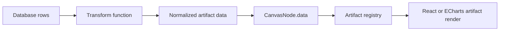

# freeform-artifacts

Browser-first Freeform-style canvas for AI-generated data artifacts.

`freeform-artifacts` is a demo product surface for placing JS/TS-rendered
artifact cards on a zoomable and pannable canvas. The first use case is
database-backed cards: raw rows can be transformed into normalized artifact data,
then rendered by registry-approved React/TypeScript components or managed
ECharts artifacts.

## Product Boundary

This project is canvas-first, not dashboard-first. The first screen should stay
focused on placing, moving, resizing, panning, zooming, and inspecting artifacts
in a Freeform-style workspace.

It is not a landing page, admin dashboard, or server management console. It is
also not a general drawing engine yet. Generated artifacts enter through the
artifact registry contract; they do not own the whole page or mutate canvas
internals directly.

## Quick Start

Install dependencies:

```sh
npm install
```

Install the browser used by Playwright verification:

```sh
npm run setup:browsers
```

Run the app:

```sh
npm run dev
```

Open the local URL:

```text
http://127.0.0.1:4177
```

Run deterministic checks:

```sh
npm run check
npm run verify:ui
npm run verify:preview
```

Create a shareable browser proof GIF:

```sh
npm run verify:proof
```

The proof run writes local evidence under:

```text
artifacts/verification/<timestamp>/
```

Those artifacts are ignored by git and are meant for local handoff evidence.
The recorder drives a complete asserted UX journey, exposes its current action
with a verification-only cursor and label, and writes `ux-checks.json` plus a
30-cell contact sheet for internal review. The GIF remains the only proof users
need to inspect.

## Project Skill

This repo includes a project-local Codex skill for future agents:

```text
skill/freeform-artifact-builder/
```

Use it when adding or revising canvas artifacts:

```sh
npx skills use ./skill --skill freeform-artifact-builder --full-depth
```

To confirm the package exposes the skill to the current `skills` CLI:

```sh
npx skills add . --list --full-depth
```

## Interactive Canvas

Current controls:

- Drag an artifact card to move it.
- Drag the selected card's labeled bottom-right resize control to resize it.
- Delete the selected artifact from its title bar, or press `Delete` or
  `Backspace` while canvas focus is outside an input.
- Keep snap-to-grid on by default for 38px world-coordinate placement; toggle
  it from **More > Snap to grid**, where a compact switch shows the current
  state while changing the setting.
- Drag empty canvas space to pan.
- Scroll with a trackpad or mouse wheel to pan naturally in either direction.
- Pinch on a trackpad to zoom around the pointer.
- Use the bottom-left zoom controls to zoom or reset the view.
- Toggle light/dark mode from the top toolbar.
- Double-click the centered canvas name to rename the current view.
- Open the collapsed **Views** sidebar to browse real canvas previews, create
  views, and switch between independent browser-local workspaces.
- Use the **More** menu to load sample query rows, import/export a versioned
  workspace backup, or explicitly reset to the authored demo.
- Click **Build with AI** and give its instruction to your coding agent. The
  prompt installs the project skill, asks the agent to learn what artifact you
  want, and then installs the result through `window.__FREEFORM_AGENT__` when
  browser control is available. Otherwise install the returned
  `.freeform-artifact.json` from the dialog.

The canvas stores nodes in world coordinates. The viewport stores screen offset
and scale. Rendering converts world coordinates into a single transformed DOM
layer, which keeps artifact components as normal React/DOM content instead of
forcing them into a low-level drawing API.

Board state is automatically saved in the browser-local workspace and restored
on reload, including the current theme and snap-to-grid preference.

## Artifact Runtime

Artifacts are registered in `src/artifacts/registry.ts`.

The registry is layered:

- `src/artifacts/core/` contains platform-provided building blocks such as
  metric and table cards.
- `src/artifacts/examples/` contains demo and verification artifacts such as the
  probability chart, Sankey, and flow diagram.
- `src/artifacts/generated/` is the reserved entry point for future user or
  AI-generated artifacts.
- `src/canvas/seeds/demoBoard.ts` chooses which artifacts appear on the default
  demo board.

## Adding A Customized Artifact

There are three trusted-code paths. Runtime bundles are the default for personal
views; repo changes remain available for app maintainers.

The product's **Build with AI** dialog creates an agent-neutral handoff. It
installs the public project skill with an interactive agent choice:

```sh
npx skills add siriusctrl/freeform-artifacts --skill freeform-artifact-builder
```

After installation, the generated instruction tells the agent to ask what the
user wants to build and clarify its data, visual form, and layout. It then asks
for one self-contained trusted bundle with `artifactId`, ESM `moduleSource`,
and initial node data, while explicitly forbidding application repo changes.
Bundles are stored in IndexedDB, dynamically registered, and installed only
into the target local view.

### Runtime Artifact Bundle

Use this for normal AI-created artifacts. An agent with browser control calls:

```js
await page.evaluate(
  ({ bundle, viewId }) => window.__FREEFORM_AGENT__.installArtifact(bundle, { viewId }),
  { bundle, viewId },
);
```

Without browser control, choose **Install bundle** in the Build with AI dialog.
Bundle modules are trusted code and are not sandboxed.

### Repo-Compiled TSX

Use this when Codex or Claude can write into the app repo and the app can be
rebuilt.

1. Create `src/artifacts/generated/my-artifact.artifact.tsx`.
2. Export `artifact`, `default`, or `artifacts`.
3. The generated registry auto-discovers `*.artifact.tsx` files with Vite
   `import.meta.glob`.
4. If the artifact should appear on the default board, add a `CanvasNode` in
   `src/canvas/seeds/demoBoard.ts`.
5. Run the verification commands.

### Runtime External ESM

Use this when the deployed app owner wants to drop trusted JavaScript modules
under `public/` without rebuilding the main app.

1. Add a compiled ESM file such as:

```text
public/artifacts/generated/my-artifact.js
```

2. Add it to:

```text
public/artifacts/generated/manifest.json
```

```json
{
  "artifacts": [
    { "module": "./my-artifact.js" }
  ]
}
```

3. Export `artifact`, `default`, or `artifacts` from the module.

External runtime modules are trusted self-hosted code. They execute in the page,
are not sandboxed, and should be treated as "take your own risk" plugins.
The loader fetches these files and imports them as Blob-backed browser modules,
so keep runtime modules self-contained instead of using relative imports.
Runtime React artifacts can use `window.React.createElement`; runtime `.js`
files cannot contain raw JSX unless they are compiled first.

An artifact is a typed object with an id, version, default size, optional
minimum size, schema hints, and a renderer-specific body.

React artifacts own their component render function:

```ts
export interface ReactArtifactDefinition<TData = unknown, TConfig = JsonObject> {
  id: string;
  title: string;
  version: string;
  defaultSize: {
    width: number;
    height: number;
  };
  minSize?: { width: number; height: number };
  dataSchema?: JsonObject;
  configSchema?: JsonObject;
  dataValidator?: ZodType<TData>;
  configValidator?: ZodType<TConfig>;
  render: (props: ArtifactRenderProps<TData, TConfig>) => React.ReactNode;
}
```

ECharts artifacts only build chart options. The host owns `echarts.init`,
`setOption`, `resize`, and `dispose`. Every render receives `size`, the live
internal content-box dimensions. On this canvas, a card renders in its
registered `defaultSize` coordinate system and the resize handle scales the
complete artifact at a locked aspect ratio. Complex artifacts should declare
`minSize` to set the smallest permitted object scale:

```ts
export interface EChartsArtifactDefinition<TData = unknown, TConfig = JsonObject> {
  id: string;
  title: string;
  version: string;
  renderer: "echarts";
  chartRenderer?: "svg" | "canvas";
  interactive?: boolean;
  defaultSize: {
    width: number;
    height: number;
  };
  minSize?: { width: number; height: number };
  dataSchema?: JsonObject;
  configSchema?: JsonObject;
  dataValidator?: ZodType<TData>;
  configValidator?: ZodType<TConfig>;
  buildOption: (props: ArtifactRenderProps<TData, TConfig>) => EChartsOption;
}
```

Canvas nodes reference artifact definitions by `artifactId`:

```ts
export interface CanvasNode<TConfig = JsonObject> {
  id: string;
  artifactId: string;
  title: string;
  x: number;
  y: number;
  width: number;
  height: number;
  zIndex: number;
  dataBinding?: DataBinding;
  data: unknown;
  config: TConfig;
}
```

## AI Artifact Contract

AI-generated artifacts should follow these rules:

- Export exactly one `ArtifactDefinition`.
- Prefer `renderer: "echarts"` for normal chart families such as line, bar,
  scatter, heatmap, treemap, graph, and Sankey.
- For ECharts artifacts, generate data transforms and `buildOption`; do not
  call `echarts.init` or manage chart lifecycle inside the artifact.
- Leave ECharts artifacts non-interactive by default so the whole card remains
  draggable. Set `interactive: true` only when the chart needs hover, tooltip,
  click, or brush behavior.
- Use React artifacts when the visual is not well represented by ECharts or
  needs custom UI composition.
- Do not mutate canvas state directly.
- Receive all display input through `data`, `config`, `theme`, and `emit`.
- Keep database-specific logic outside the render component.
- Put data shaping in a named transform before artifact rendering.
- Add a Zod `dataValidator` for runtime payload validation.
- Use deterministic layout; do not depend on global timers, random values, or
  network fetches during render.
- Declare default width and height so the canvas can place the artifact before
  rendering it.
- Treat `emit` as the only outward event channel.

The intended pipeline is:



## Rendering Boundary

This demo intentionally uses DOM-based artifacts rather than drawing all content
into `<canvas>`. That keeps tables, charts, forms, text selection, layout, and
future accessibility work close to the browser platform.

The product boundary is:

```text
  user input / AI request
          |
          v
  artifact definition + data transform
          |
          v
  registry-approved artifact
          |
          v
  canvas node in world coordinates
          |
          v
  DOM render inside pan/zoom viewport
```

## Project Status

Implemented:

- React/TypeScript/Vite demo app.
- Pannable and zoomable dotted canvas.
- Draggable artifact nodes.
- Resizable selected artifact nodes.
- Selected-artifact deletion through a title-bar control and keyboard shortcuts.
- Default-on 38px snap-to-grid placement with a labeled More-menu toggle.
- Aspect-locked whole-object resizing with artifact-specific minimum scales.
- Published demo template with a per-browser local workspace fork.
- Multiple named local canvas views with a smoothly animated,
  default-collapsed **Views** sidebar and data-derived page previews.
- IndexedDB workspace persistence with a synchronous local-storage recovery
  mirror and versioned JSON import/export.
- Transform registry with fixtures for raw query rows.
- Zod-backed artifact payload validation with invalid-card fallback rendering.
- Registry-backed metric, table, flow-diagram, probability chart, and Sankey
  artifacts, polished and verified in both light and dark mode.
- Layered artifact registries for core, example, and future generated
  artifacts.
- Auto-discovered repo-generated TSX artifacts and base-aware trusted runtime
  ESM loading through `artifacts/generated/manifest.json`.
- GitHub Pages deployment under `/freeform-artifacts/`.
- Playwright UI smoke test.
- Browser proof GIF recorder.
- Lightweight proof frame checks and production preview verification.
- Light/dark theme support.
- Compact application chrome with self-hosted Instrument Sans for interface
  prose and Geist Mono for comparable data values.
- No-deploy artifact bundle installation through **Build with AI** and the
  browser Agent API.
- Hardened pointer dragging that suppresses browser text selection and native
  drag behavior during canvas moves.
- Handoff docs for the next Codex session.
- Project-local `freeform-artifact-builder` skill for future artifact work.
- Artifact visual style guide covering hierarchy, spacing, chart composition,
  categorical color, and required dark-mode behavior.

TODO:

- Add multi-select and z-order controls.
- Add sandbox strategy before loading untrusted generated code.
- Add file/API import for arbitrary database query result JSON.
- Add richer visual diff thresholds beyond the current blank-frame checks.

## Public demo and local workspaces

The public URL opens the `market-overview` template. The template is immutable:
on first visit, the app copies it into the first named view owned by that browser
origin. Users can create more empty views from the sidebar.
Every later drag, resize, delete, zoom, theme change, or data import
is saved locally and restored when the page is reopened.

```text
published template -> first-visit browser fork -> IndexedDB workspace
                                           \-> localStorage recovery mirror
```

Visitors do not share state because the static deployment has no shared board
backend. Isolation is scoped to the browser profile and site origin. It does not
provide account identity, cross-device sync, or persistence after the user
clears site data. Use the toolbar import/export actions for explicit backup and
transfer.

Template URLs use a query parameter so they remain compatible with static
GitHub Pages routing:

```text
https://siriusctrl.github.io/freeform-artifacts/?board=market-overview
```

## Documentation

Read these first when getting oriented:

1. `README.md`
2. `AGENTS.md`
3. `CHANGELOG.md`
4. `docs/INDEX.md`

Maintainer details live under `docs/`.

Design and engineering tradeoffs are recorded in
`docs/architecture-decisions.md`.
