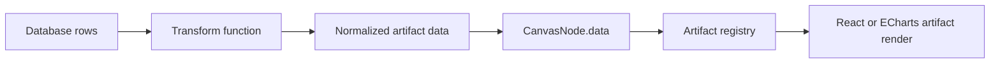

# freeform-artifacts

Browser-first Freeform-style canvas for AI-generated data artifacts.

`freeform-artifacts` is a demo product surface for placing JS/TS-rendered
artifact cards on a zoomable and pannable canvas. The first use case is
database-backed cards: raw rows can be transformed into normalized artifact data,
then rendered by registry-approved React/TypeScript components or managed
ECharts artifacts.

## Quick Start

Install dependencies:

```sh
npm install
```

Install the browser used by Playwright verification:

```sh
npm run setup:browsers
```

Run the app:

```sh
npm run dev
```

Open the local URL:

```text
http://127.0.0.1:4177
```

Run deterministic checks:

```sh
npm run check
npm run verify:ui
npm run verify:preview
```

Create a shareable browser proof GIF:

```sh
npm run verify:proof
```

The proof run writes local evidence under:

```text
artifacts/verification/<timestamp>/
```

Those artifacts are ignored by git and are meant for local handoff evidence.

## Project Skill

This repo includes a project-local Codex skill for future agents:

```text
skill/freeform-artifact-builder/
```

Use it when adding or revising canvas artifacts:

```sh
npx skills use ./skill --skill freeform-artifact-builder --full-depth
```

To confirm the package exposes the skill to the current `skills` CLI:

```sh
npx skills add . --list --full-depth
```

## Interactive Canvas

Current controls:

- Drag an artifact card to move it.
- Drag the selected card's bottom-right handle to resize it.
- Drag empty canvas space to pan.
- Scroll over the canvas to zoom around the pointer.
- Use the bottom-left zoom controls to zoom or reset the view.
- Toggle light/dark mode from the top toolbar.
- Import a sample query result from the data toolbar button; this runs raw rows
  through the transform registry before updating cards.
- Export the current board as JSON from the toolbar.
- Click **Add artifact** to insert a registry-backed example card.

The canvas stores nodes in world coordinates. The viewport stores screen offset
and scale. Rendering converts world coordinates into a single transformed DOM
layer, which keeps artifact components as normal React/DOM content instead of
forcing them into a low-level drawing API.

Board state is automatically saved in local storage and restored on reload.

## Artifact Runtime

Artifacts are registered in `src/artifacts/registry.ts`.

The registry is layered:

- `src/artifacts/core/` contains platform-provided building blocks such as
  metric and table cards.
- `src/artifacts/examples/` contains demo and verification artifacts such as the
  probability chart, Sankey, and flow diagram.
- `src/artifacts/generated/` is the reserved entry point for future user or
  AI-generated artifacts.
- `src/canvas/seeds/demoBoard.ts` chooses which artifacts appear on the default
  demo board.

## Adding A Customized Artifact

There are two trusted-code paths.

### Repo-Compiled TSX

Use this when Codex or Claude can write into the app repo and the app can be
rebuilt.

1. Create `src/artifacts/generated/my-artifact.artifact.tsx`.
2. Export `artifact`, `default`, or `artifacts`.
3. The generated registry auto-discovers `*.artifact.tsx` files with Vite
   `import.meta.glob`.
4. If the artifact should appear on the default board, add a `CanvasNode` in
   `src/canvas/seeds/demoBoard.ts`.
5. Run the verification commands.

### Runtime External ESM

Use this when the deployed app owner wants to drop trusted JavaScript modules
under `public/` without rebuilding the main app.

1. Add a compiled ESM file such as:

```text
public/artifacts/generated/my-artifact.js
```

2. Add it to:

```text
public/artifacts/generated/manifest.json
```

```json
{
  "artifacts": [
    { "module": "/artifacts/generated/my-artifact.js" }
  ]
}
```

3. Export `artifact`, `default`, or `artifacts` from the module.

External runtime modules are trusted self-hosted code. They execute in the page,
are not sandboxed, and should be treated as "take your own risk" plugins.
The loader fetches these files and imports them as Blob-backed browser modules,
so keep runtime modules self-contained instead of using relative imports.
Runtime React artifacts can use `window.React.createElement`; runtime `.js`
files cannot contain raw JSX unless they are compiled first.

An artifact is a typed object with an id, version, default size, optional data
schema hints, optional config schema hints, and a renderer-specific body.

React artifacts own their component render function:

```ts
export interface ReactArtifactDefinition<TData = unknown, TConfig = JsonObject> {
  id: string;
  title: string;
  version: string;
  defaultSize: {
    width: number;
    height: number;
  };
  dataSchema?: JsonObject;
  configSchema?: JsonObject;
  dataValidator?: ZodType<TData>;
  configValidator?: ZodType<TConfig>;
  render: (props: ArtifactRenderProps<TData, TConfig>) => React.ReactNode;
}
```

ECharts artifacts only build chart options. The host owns `echarts.init`,
`setOption`, `resize`, and `dispose`:

```ts
export interface EChartsArtifactDefinition<TData = unknown, TConfig = JsonObject> {
  id: string;
  title: string;
  version: string;
  renderer: "echarts";
  chartRenderer?: "svg" | "canvas";
  interactive?: boolean;
  defaultSize: {
    width: number;
    height: number;
  };
  dataSchema?: JsonObject;
  configSchema?: JsonObject;
  dataValidator?: ZodType<TData>;
  configValidator?: ZodType<TConfig>;
  buildOption: (props: ArtifactRenderProps<TData, TConfig>) => EChartsOption;
}
```

Canvas nodes reference artifact definitions by `artifactId`:

```ts
export interface CanvasNode<TConfig = JsonObject> {
  id: string;
  artifactId: string;
  title: string;
  x: number;
  y: number;
  width: number;
  height: number;
  zIndex: number;
  dataBinding?: DataBinding;
  data: unknown;
  config: TConfig;
}
```

## AI Artifact Contract

AI-generated artifacts should follow these rules:

- Export exactly one `ArtifactDefinition`.
- Prefer `renderer: "echarts"` for normal chart families such as line, bar,
  scatter, heatmap, treemap, graph, and Sankey.
- For ECharts artifacts, generate data transforms and `buildOption`; do not
  call `echarts.init` or manage chart lifecycle inside the artifact.
- Leave ECharts artifacts non-interactive by default so the whole card remains
  draggable. Set `interactive: true` only when the chart needs hover, tooltip,
  click, or brush behavior.
- Use React artifacts when the visual is not well represented by ECharts or
  needs custom UI composition.
- Do not mutate canvas state directly.
- Receive all display input through `data`, `config`, `theme`, and `emit`.
- Keep database-specific logic outside the render component.
- Put data shaping in a named transform before artifact rendering.
- Add a Zod `dataValidator` for runtime payload validation.
- Use deterministic layout; do not depend on global timers, random values, or
  network fetches during render.
- Declare default width and height so the canvas can place the artifact before
  rendering it.
- Treat `emit` as the only outward event channel.

The intended pipeline is:



## Rendering Boundary

This demo intentionally uses DOM-based artifacts rather than drawing all content
into `<canvas>`. That keeps tables, charts, forms, text selection, layout, and
future accessibility work close to the browser platform.

The product boundary is:

```text
  user input / AI request
          |
          v
  artifact definition + data transform
          |
          v
  registry-approved artifact
          |
          v
  canvas node in world coordinates
          |
          v
  DOM render inside pan/zoom viewport
```

## Project Status

Implemented:

- React/TypeScript/Vite demo app.
- Pannable and zoomable dotted canvas.
- Draggable artifact nodes.
- Resizable selected artifact nodes.
- Selection inspector.
- Persistent board serialization in local storage and JSON export.
- Transform registry with fixtures for raw query rows.
- Zod-backed artifact payload validation with invalid-card fallback rendering.
- Registry-backed metric, table, flow-diagram, probability chart, and Sankey
  artifacts.
- Layered artifact registries for core, example, and future generated
  artifacts.
- Auto-discovered repo-generated TSX artifacts and trusted runtime ESM artifact
  loading through `/artifacts/generated/manifest.json`.
- Playwright UI smoke test.
- Browser proof GIF recorder.
- Lightweight proof frame checks and production preview verification.
- Light/dark theme support.
- Hardened pointer dragging that suppresses browser text selection and native
  drag behavior during canvas moves.
- Handoff docs for the next Codex session.
- Project-local `freeform-artifact-builder` skill for future artifact work.

TODO:

- Add multi-select and z-order controls.
- Add sandbox strategy before loading untrusted generated code.
- Add file/API import for arbitrary database query result JSON.
- Add richer visual diff thresholds beyond the current blank-frame checks.
- Add board JSON import.

## Documentation

Read these first when getting oriented:

1. `README.md`
2. `AGENTS.md`
3. `CHANGELOG.md`
4. `docs/INDEX.md`

Maintainer details live under `docs/`.

Design and engineering tradeoffs are recorded in
`docs/architecture-decisions.md`.
