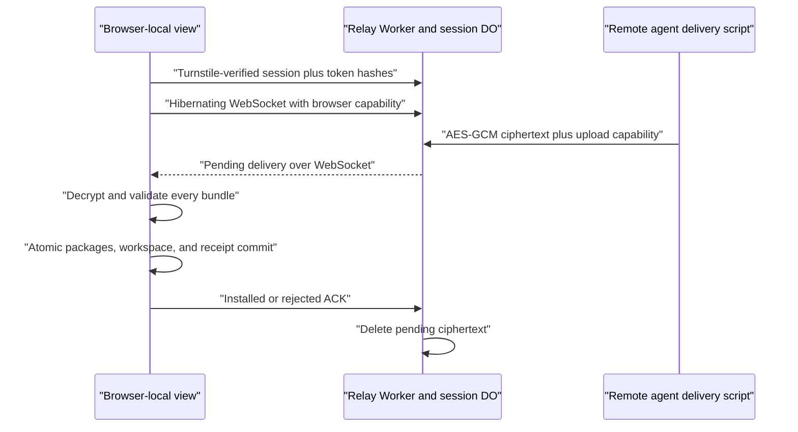
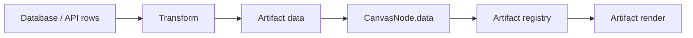

# Architecture

`freeform-artifacts` is a browser canvas for placing AI-generated data
artifacts. The product is not a dashboard builder yet, and it is not a drawing
engine. The first boundary is a zoomable/pannable workspace that hosts
registry-approved React/TypeScript artifact cards and managed chart artifacts.

The core boundary is:

```text
  +------------------+      +------------------+      +-------------------+
  | User / AI intent |      | Data source      |      | Transform         |
  |                  |      |                  |      |                   |
  | "show revenue"  +----->+ database rows    +----->+ normalized data   |
  +------------------+      +------------------+      +---------+---------+
                                                               |
                                                               v
                       +----------------+----------------------+-------------+
                       |                |                      |             |
                       v                v                      v             v
                 +-----------+    +-------------+       +------------+  +---------+
                 | Artifact  |    | Canvas node |       | Viewport   |  | Browser |
                 | registry  |    | world coords|       | pan/zoom   |  | render  |
                 +-----------+    +-------------+       +------------+  +---------+
```

## Product Boundary

The app should answer four questions:

- What artifact types are allowed?
- What data shape does an artifact expect?
- Where is the artifact placed in the canvas world?
- How does the user inspect, move, pan, and zoom that world?

It should not let generated code own the whole page or mutate canvas internals.
Generated artifacts are plugins only at the registry boundary.

## Canvas State

Canvas state is split into two layers:

```ts
interface CanvasViewport {
  x: number;
  y: number;
  scale: number;
}

interface CanvasNode {
  id: string;
  artifactId: string;
  title: string;
  x: number;
  y: number;
  width: number;
  height: number;
  zIndex: number;
  dataBinding?: DataBinding;
  data: unknown;
  config: Record<string, unknown>;
}
```

`CanvasViewport` is screen-facing state. `CanvasNode` positions are world-facing
state. Keep them separate so board serialization, collaboration, and replay can
store stable artifact positions independent of the user's current zoom.

The current runtime exposes `window.__FREEFORM_STATE__` only for browser
verification. Do not build product features on that debug handle.

Canvas board state is serialized inside a versioned `WorkspaceRecord`. Published
templates are immutable seeds. On first visit, the selected template is copied
to the first browser-local view. Additional named views use unique ids while
retaining the historical `templateId` field as their IndexedDB key. Navigation
summaries retain only node geometry and artifact ids for page previews; they do
not cache screenshots or mount artifact renderers a second time. IndexedDB is
the primary store. Interaction-driven saves are debounced and serialized per
view; `pagehide` synchronously writes the latest localStorage recovery mirror if
a page closes before the next IndexedDB transaction. The persisted board
includes nodes, viewport, selected node, theme mode, and the snap-to-grid
preference. Node positions can be snapped to the 38px world-coordinate grid by
the canvas shell. Resize remains aspect-locked and independent of grid snapping;
artifacts do not own placement behavior.

This is browser-profile isolation, not account identity. The static app has no
shared board backend, so separate browser contexts cannot see each other's
workspaces. Clearing site data removes the workspace, and cross-device sync is
outside the current product boundary. Versioned `.freeform.json` import/export
is the explicit portability path for serializable board data, not executable
personal artifact packages. Import validates that every referenced artifact is
available and asks the user to install missing packages before changing the view.
Artifact render data remains serializable and is validated when rendered.

Trusted runtime artifact bundles are stored separately in the IndexedDB
`artifact-packages` store. A bundle contains self-contained ESM source and one
initial node payload. The runtime Blob-imports installed sources, merges them
into the registry, and stores only node references/data in each view. The
`window.__FREEFORM_AGENT__` bridge lets a browser-controlling agent list views
and inspect renderer capabilities, validate a bundle without persistence, and
install it into a target view without rebuilding the app.
Package ids are browser-origin-wide immutable identities, while nodes remain
view-scoped. Package and target workspace writes share one IndexedDB transaction;
invalid targets and payloads are rejected before persistence. Loader failures
are quarantined per source/package, and renderer errors are isolated per card.

## Artifact Delivery Relay

**Build with AI** opens a roughly 30-minute, view-bound delivery session. It does
not move durable workspace state to a backend. The browser creates separate
browser and uploader capabilities plus a 256-bit AES-GCM key, sends only
capability hashes to the relay, and copies the uploader capability and key into
the agent handoff. The Worker therefore sees routing metadata, artifact count,
ciphertext size, and encrypted payloads, but never bundle source, node data, or
the decryption key.



The version 1 transport lives under `relay/` and uses one SQLite-backed Durable
Object per session. Access ends at the 30-minute expiry timestamp; its alarm
then deletes the SQL tables and ciphertext. Hibernating
WebSockets avoid polling and allow an idle session to release Worker memory.
The Durable Object stores session metadata, SHA-256 capability hashes,
idempotency outcomes, and bounded pending ciphertext. It does not use D1, KV, or
R2 and never stores canvases or artifact registries.

One session accepts several deliveries; one delivery contains 1–12 bundles.
The uploader capability is reusable only within that session, while every
delivery uses a UUID plus an envelope digest that cannot represent different
ciphertext on retry. The delivery script keeps the encrypted envelope (never
the key or upload capability) in a private OS cache only while an outcome is
ambiguous so a later process can make a byte-identical retry. Definitive results
delete it; later runs opportunistically prune owned entries older than 24 hours.
A changed payload, unauthenticated cache entry, or missing retry cache fails
locally. The browser serializes processing. It validates the complete decrypted
selection,
then writes all packages, the target workspace, and a delivery receipt in one
IndexedDB transaction. If the network drops after that commit but before ACK,
the Durable Object replays the ciphertext and the browser uses the receipt to
ACK without adding duplicate nodes. Rejected selections leave no package,
workspace, or receipt fragment. The transaction reads the latest persisted
workspace, merges delivered nodes, and returns that exact committed record to
the live tab; the tab skips its otherwise redundant autosave so a same-view edit
saved by another tab is not overwritten by a stale pre-delivery snapshot.

Browser-only capability material stays in module-private page memory and is not
written to Web Storage. Reloading therefore ends the browser side of a Build
Session. The upload capability and encryption key appear only in the copied
agent handoff, are visually masked in the dialog, and enter the uploader over
stdin rather than process arguments.

Placement stays host-owned. The session captures its target view and stage size;
navigation never retargets it. Installation uses that view's current or last
persisted viewport, snaps the candidate to the 38px grid, searches outward from
the center for the nearest fully visible non-overlapping position, and assigns
successively highest z-indices. If no complete position exists, the first card
stays centered on top and additional cards offset diagonally by one grid step.

Session creation requires a strict allowed browser origin and Turnstile. The
Worker applies an IP creation limit and a per-source upload limit. Only a
request whose upload capability the Durable Object has authenticated consumes
the per-session upload budget. Additional limits include 24 delivery ids,
2 MB ciphertext per delivery, and 8 MB pending ciphertext
per session. Browser WebSocket and agent upload capabilities cannot substitute
for one another. The fixed Turnstile test token is accepted only in the exact
`development` environment from a loopback origin; every other environment
fails closed without a real secret. `RELAY_ENABLED` is the operational kill switch. The existing
file installer and direct same-browser Agent API remain offline/local fallbacks.

The Artifact Library projects two sources into one placement UI:

- Built-in entries pair registered system artifacts with reusable demo presets.
- Yours entries pair successfully loaded IndexedDB bundles with their initial
  node payloads.

The catalog does not duplicate executable source or workspace state. Removing a
node changes only its active view; the package remains available to every view
on the same browser origin. Clicking an entry starts at the current viewport
center and searches its visible world grid for an open position, falling back
to center/top when the view is full. Dragging carries only a catalog id and
converts the drop point from screen coordinates into canvas world coordinates
before optional grid snap. Separate browser profiles retain isolated package
stores.

Artifact Library recognition comes from the renderer itself rather than a
category glyph. Each entry mounts its catalog preset through the same validated
React, Chart Kit, or ECharts content surface used by a canvas node, at the
artifact's default size and current theme. A fixed thumbnail frame applies a
single contain scale to the complete node, including chrome, so it never crops a
chart annotation or stretches one axis. IntersectionObserver limits mounts to
the library scroller's visible neighborhood; offscreen ECharts instances are
disposed, and each preview subtree is inert with animation and pointer
interaction disabled. This is intentionally different from Views navigation
previews, which remain renderer-free geometry summaries of complete boards.

Canvas-level keyboard commands live in one guarded hook. `Cmd/Ctrl+B` toggles
Views, `Shift+Cmd/Ctrl+A` toggles Artifacts, `Cmd/Ctrl+0` resets the viewport,
`+`/`-` zoom, and `Escape` dismisses the active panel or selection. Editable
targets and the modal AI handoff are excluded from global handling.

## Artifact Registry

Artifact definitions live behind this interface:

```ts
interface ArtifactBase<TData = unknown, TConfig = JsonObject> {
  id: string;
  title: string;
  version: string;
  defaultSize: {
    width: number;
    height: number;
  };
  minSize?: {
    width: number;
    height: number;
  };
  dataSchema?: JsonObject;
  configSchema?: JsonObject;
  dataValidator?: ZodType<TData>;
  configValidator?: ZodType<TConfig>;
}

interface ReactArtifactDefinition<TData = unknown, TConfig = JsonObject>
  extends ArtifactBase<TData, TConfig> {
  renderer?: "react";
  render: (props: ArtifactRenderProps<TData, TConfig>) => React.ReactNode;
}

interface EChartsArtifactDefinition<TData = unknown, TConfig = JsonObject>
  extends ArtifactBase<TData, TConfig> {
  renderer: "echarts";
  chartRenderer?: "svg" | "canvas";
  interactive?: boolean;
  buildOption: (props: ArtifactRenderProps<TData, TConfig>) => EChartsOption;
}

interface ChartKitArtifactDefinition<TData = unknown, TConfig = JsonObject>
  extends ArtifactBase<TData, TConfig> {
  renderer: "chart-kit";
  buildChart: (props: ArtifactRenderProps<TData, TConfig>) => ChartKitSpec;
}

type ArtifactDefinition<TData = unknown, TConfig = JsonObject> =
  | ReactArtifactDefinition<TData, TConfig>
  | EChartsArtifactDefinition<TData, TConfig>
  | ChartKitArtifactDefinition<TData, TConfig>;
```

The registry maps `artifactId` to an `ArtifactDefinition`. Canvas nodes store
only the `artifactId`, placement data, config, and normalized render data.

Chart Kit is a declarative compatibility layer over managed ECharts. Version 1
supports Cartesian bar, line, and combo specs. It owns dataset encoding, dual-
theme tokens, axes, grid, tooltip, palette, ARIA, and SVG rendering. Raw ECharts
remains an escape hatch for registered bar, line, and Sankey behavior; a browser
bundle cannot register additional tree-shaken host modules.

The registry is layered:

- `core` artifacts are platform-provided primitives.
- `examples` artifacts are demo and verification fixtures.
- `generated` artifacts are the user/AI extension point.

The default demo board lives in `src/canvas/seeds/demoBoard.ts` so example
layout does not become part of the registry contract.

Generated artifacts have three trusted loading paths:

- browser-installed `.freeform-artifact.json` bundles, persisted in IndexedDB
  and attached to one local view through the Agent API;
- repo-compiled `src/artifacts/generated/**/*.artifact.tsx`, discovered by
  Vite `import.meta.glob`;
- runtime external ESM modules listed in
  `artifacts/generated/manifest.json`, fetched relative to the Vite base path
  and imported as Blob-backed
  modules.

Browser bundles and external ESM modules are not sandboxed. Browser bundles are
trusted personal code scoped to one browser origin. External modules are for
self-hosted deployments where the owner accepts the risk of running their own
generated code. Both forms must be self-contained browser JavaScript because
Blob module URLs do not provide a stable relative import base.

This keeps AI generation bounded:

- AI can propose a new artifact module.
- The runtime can validate and register that module.
- The canvas can place the artifact without knowing internal render details.

Artifacts keep lightweight JSON-schema-shaped hints for handoff and future
tooling, and current runtime validation uses Zod validators attached to artifact
definitions. If validation fails, the canvas renders an invalid-artifact
fallback instead of letting an artifact crash the board.

Use `renderer: "chart-kit"` for ordinary bar, line, and combo charts. Artifacts
provide analytical intent and normalized values; Chart Kit supplies the shared
dataset, axes, grid, tooltip, palette, ARIA, and light/dark styling. Use raw
`renderer: "echarts"` only for host-registered behavior Chart Kit cannot
express. In both paths, the ECharts host owns lifecycle, resize behavior, and
the concrete SVG/canvas renderer. Raw ECharts artifacts are non-interactive by
default so the card body still drags like any other canvas node. Set
`interactive: true` only for artifacts that need chart-level hover, tooltip,
click, or brush behavior. Use React artifacts for non-chart UI and bespoke
composition.

`ArtifactRenderProps.size` is the live artifact content-box size. The managed
host updates it through `ResizeObserver`, calls `chart.resize()`, and rebuilds
the option when its internal dimensions change. Canvas cards normally keep that
internal box at the registered `defaultSize`: the selected resize handle locks
the aspect ratio and applies one local transform to the complete node, including
chart, chrome, Delete, and resize controls. Canvas zoom is a second outer
transform on `.canvas-world`. Complex artifacts should declare `minSize`, which
the canvas converts into a proportional minimum object scale.

## Data Pipeline

Database data should flow through transforms before rendering:



Transform rules:

- Keep raw database rows out of render components unless the artifact explicitly
  declares a row-oriented shape.
- Name transforms and make them testable.
- Register reusable transforms in `src/data/transforms.ts`.
- Prefer stable normalized data over implicit database column assumptions.
- Keep network fetches outside artifact render functions.

## Renderer Choice

The demo uses DOM artifacts inside a transformed world layer:

```text
canvas-stage
  grid-plane
  canvas-world transform(translate + scale)
    canvas-node transform(translate)
      node chrome
      artifact React render or managed ECharts host
```

This is deliberate. DOM rendering keeps tables, labels, controls, and future
accessibility behavior on the browser platform. A pure `<canvas>` renderer would
make arbitrary TS/JS artifact cards harder to build and inspect.

ECharts artifacts still live in the DOM world. Their host mounts a chart inside
the card body and keeps the chart lifecycle separate from AI-generated
artifact definitions.

Theme adaptation belongs to each artifact definition because ECharts option
colors are not inherited from host CSS. Every ECharts artifact must derive its
title, axis, legend, annotation, tooltip, mark, node, link, and emphasis colors
from `theme.mode`; the generic host owns lifecycle only. React artifacts should
use host theme variables or the provided `CanvasTheme` rather than fixed light
surfaces.

Use a pure drawing engine only if the product boundary shifts toward freehand
ink, geometric shapes, or extremely large visual primitive counts.

## Runtime Module Boundaries

`src/App.tsx` is the view-bootstrap and relay-routing boundary: it opens,
creates, and switches browser-local views, and routes a delivery to the active
installer or the stored target view without retargeting it.
`src/canvas/CanvasWorkspace.tsx` composes the active canvas, while focused
runtime and autosave hooks load artifacts and persist board state.
The workspace publishes Playwright debug state and wires product actions such as
import/export, theme switching, snap preference, deletion, and the AI handoff dialog. Personal
artifact creation is bundle-first: a remote agent delivers encrypted bundles
through `src/relay/`, a same-browser agent uses `window.__FREEFORM_AGENT__`, or
the user imports the same bundle file. None requires an application commit or
deploy. The copyable handoff is agent-neutral: it installs the project skill,
then asks the agent to question the user before authoring and delivering one or
more bundles.

Canvas runtime behavior lives under `src/canvas/`:

- `components/` renders the toolbar, board, canvas nodes, and zoom controls.
- `hooks/useCanvasInteractions.ts` owns pointer drag, resize, wheel pan, pinch
  zoom, toolbar zoom, z-order bumping, and snap-to-grid math.
- `debugState.ts` is the only place that writes `window.__FREEFORM_STATE__`.
- `src/relay/` owns browser session consent, capabilities, encryption,
  reconnect/replay, atomic multi-bundle preparation, and placement.
- `relay/` is the independently deployable transport Worker and Durable Object;
  it must remain unable to decrypt artifact source or own durable product state.

Styles are also split by domain under `src/styles/` and imported through
`src/styles.css`. Keep new visual rules near the surface they style instead of
growing the entry file.

The typography system separates interface prose from data comparison:
Instrument Sans is self-hosted for chrome, headings, and explanatory text;
Geist Mono is self-hosted for numeric values, dates, quarters, and axes. The
top bar is intentionally compact application chrome, so secondary commands
must remain in More instead of accumulating equal-weight pills.

## Future Boundaries

Before loading untrusted AI-generated code, add a sandbox strategy. Candidate
approaches:

- Build-time only artifact review for trusted local demos.
- Runtime iframe sandbox for generated cards.
- Server-side validation and bundling before registry import.
- JSON-schema or Zod validation for `data` and `config`.

The current demo is a trusted-code prototype, not an untrusted plugin runtime.
