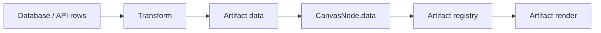

# Architecture

`freeform-artifacts` is a browser canvas for placing AI-generated data
artifacts. The product is not a dashboard builder yet, and it is not a drawing
engine. The first boundary is a zoomable/pannable workspace that hosts
registry-approved React/TypeScript artifact cards and managed chart artifacts.

The core boundary is:

```text
  +------------------+      +------------------+      +-------------------+
  | User / AI intent |      | Data source      |      | Transform         |
  |                  |      |                  |      |                   |
  | "show revenue"  +----->+ database rows    +----->+ normalized data   |
  +------------------+      +------------------+      +---------+---------+
                                                               |
                                                               v
                       +----------------+----------------------+-------------+
                       |                |                      |             |
                       v                v                      v             v
                 +-----------+    +-------------+       +------------+  +---------+
                 | Artifact  |    | Canvas node |       | Viewport   |  | Browser |
                 | registry  |    | world coords|       | pan/zoom   |  | render  |
                 +-----------+    +-------------+       +------------+  +---------+
```

## Product Boundary

The app should answer four questions:

- What artifact types are allowed?
- What data shape does an artifact expect?
- Where is the artifact placed in the canvas world?
- How does the user inspect, move, pan, and zoom that world?

It should not let generated code own the whole page or mutate canvas internals.
Generated artifacts are plugins only at the registry boundary.

## Canvas State

Canvas state is split into two layers:

```ts
interface CanvasViewport {
  x: number;
  y: number;
  scale: number;
}

interface CanvasNode {
  id: string;
  artifactId: string;
  title: string;
  x: number;
  y: number;
  width: number;
  height: number;
  zIndex: number;
  dataBinding?: DataBinding;
  data: unknown;
  config: Record<string, unknown>;
}
```

`CanvasViewport` is screen-facing state. `CanvasNode` positions are world-facing
state. Keep them separate so board serialization, collaboration, and replay can
store stable artifact positions independent of the user's current zoom.

The current runtime exposes `window.__FREEFORM_STATE__` only for browser
verification. Do not build product features on that debug handle.

Canvas board state is serialized as a versioned JSON object in local storage.
The persisted shape includes nodes, viewport, selected node, and theme mode.
Artifact render data remains serializable and is validated when rendered.

## Artifact Registry

Artifact definitions live behind this interface:

```ts
interface ArtifactBase<TData = unknown, TConfig = JsonObject> {
  id: string;
  title: string;
  version: string;
  defaultSize: {
    width: number;
    height: number;
  };
  dataSchema?: JsonObject;
  configSchema?: JsonObject;
  dataValidator?: ZodType<TData>;
  configValidator?: ZodType<TConfig>;
}

interface ReactArtifactDefinition<TData = unknown, TConfig = JsonObject>
  extends ArtifactBase<TData, TConfig> {
  renderer?: "react";
  render: (props: ArtifactRenderProps<TData, TConfig>) => React.ReactNode;
}

interface EChartsArtifactDefinition<TData = unknown, TConfig = JsonObject>
  extends ArtifactBase<TData, TConfig> {
  renderer: "echarts";
  chartRenderer?: "svg" | "canvas";
  interactive?: boolean;
  buildOption: (props: ArtifactRenderProps<TData, TConfig>) => EChartsOption;
}

type ArtifactDefinition<TData = unknown, TConfig = JsonObject> =
  | ReactArtifactDefinition<TData, TConfig>
  | EChartsArtifactDefinition<TData, TConfig>;
```

The registry maps `artifactId` to an `ArtifactDefinition`. Canvas nodes store
only the `artifactId`, placement data, config, and normalized render data.

This keeps AI generation bounded:

- AI can propose a new artifact module.
- The runtime can validate and register that module.
- The canvas can place the artifact without knowing internal render details.

Artifacts keep lightweight JSON-schema-shaped hints for handoff and future
tooling, and current runtime validation uses Zod validators attached to artifact
definitions. If validation fails, the canvas renders an invalid-artifact
fallback instead of letting an artifact crash the board.

Use `renderer: "echarts"` for normal chart families. In that path, artifacts
provide `buildOption` and the ECharts host owns lifecycle, resize behavior, and
the concrete SVG/canvas renderer. ECharts artifacts are non-interactive by
default so the card body still drags like any other canvas node. Set
`interactive: true` only for artifacts that need chart-level hover, tooltip,
click, or brush behavior. Use React artifacts as the custom escape hatch for
visuals or interaction patterns ECharts does not express well.

## Data Pipeline

Database data should flow through transforms before rendering:



Transform rules:

- Keep raw database rows out of render components unless the artifact explicitly
  declares a row-oriented shape.
- Name transforms and make them testable.
- Register reusable transforms in `src/data/transforms.ts`.
- Prefer stable normalized data over implicit database column assumptions.
- Keep network fetches outside artifact render functions.

## Renderer Choice

The demo uses DOM artifacts inside a transformed world layer:

```text
canvas-stage
  grid-plane
  canvas-world transform(translate + scale)
    canvas-node transform(translate)
      node chrome
      artifact React render or managed ECharts host
```

This is deliberate. DOM rendering keeps tables, labels, controls, and future
accessibility behavior on the browser platform. A pure `<canvas>` renderer would
make arbitrary TS/JS artifact cards harder to build and inspect.

ECharts artifacts still live in the DOM world. Their host mounts a chart inside
the card body and keeps the chart lifecycle separate from AI-generated
artifact definitions.

Use a pure drawing engine only if the product boundary shifts toward freehand
ink, geometric shapes, or extremely large visual primitive counts.

## Future Boundaries

Before loading untrusted AI-generated code, add a sandbox strategy. Candidate
approaches:

- Build-time only artifact review for trusted local demos.
- Runtime iframe sandbox for generated cards.
- Server-side validation and bundling before registry import.
- JSON-schema or Zod validation for `data` and `config`.

The current demo is a trusted-code prototype, not an untrusted plugin runtime.
